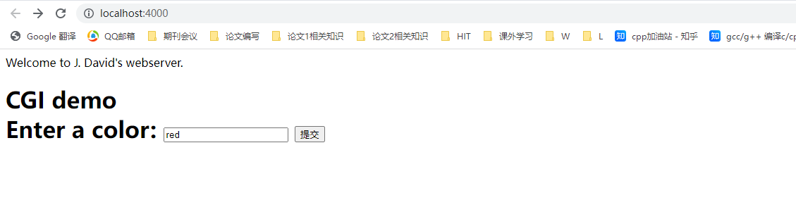

## 概述

- **[Tinyhttpd](https://github.com/EZLippi/Tinyhttpd)**: github仓库
- 一个超轻量型Http Server，使用C语言开发，全部代码不到600行，附带一个简单的Client，

## 源码分析

### 源码阅读

- 建议源码阅读顺序： main -> startup -> accept_request -> execute_cgi, 通晓主要工作流程后再仔细把每个函数的源码看一看。
- 各部分代码作用见程序注释

### 源码拓展

```c
// httpd.c-main()
u_short port = 4000;        // 服务器套接字监听的端口
```

- `u_short`：`<types.h>`中提供的类型别名

  ```
  u_short -> __u_short -> unsigned short int
  ```

- port最大为655532(2^16 - 1), short类型在32/64位都是2字节，使用无符号short刚好能表示所有port

---

```c
// httpd.c - error_die
perror(sc);
```
- `void perror(const char *str)`: C库函数，把一个描述性错误输出到标准错误stderr. 首先输出字符串 str，后跟一个冒号，然后是一个空格

---

```c
// httpd.c - startup()
if((setsockopt(serv_sock, SOL_SOCKET, SO_REUSEADDR, &on, sizeof(on))) < 0)
 38                 error_handling("setsockopt() error");
```
- 为什们要取消Time-wait?
  - 首先，要了解Time-wait,主要影响是当服务器端主动断开连接后，由于TCP的特性，导致关闭的服务器套接字不能立刻被使用
  - 通常，一旦服务器向客户端发送了响应信息，那么就会关闭TCPL连接。但是，默认HTTP/1.0协议会设置`connection:keep-Acliev`, 那么 TCP 连接在服务器返回信息后，仍然保持打开状态，也就是只有当客户端主动关闭页面时（针对Web服务器）才会断开连接。在这种场景下，始终有客户端主动断开，所以就不需要time-wait了.
---
```c
// httpd.c - startup()
if (*port == 0)  /* if dynamically allocating a port */
```
-  不太懂这里为什么需要这样一个判断，感觉没有必要，因此从代码上看，port一定是4000
- 当一个知识点就好： **当port=0时,bind会随机为套接字绑定端口**

```c
// htpd.c-main()
socklen_t  client_name_len = sizeof(client_name);
client_sock = accept(server_sock,(struct sockaddr *)&client_name, &client_name_len);
```

- `socklen_t`：`<socket.h>`中提供的类型别名

  ```
  socklen_t -> __socklen_t ->  __U32_TYPE -> unsigned int
  ```

- socket编程中的accept函数的第三个参数的长度必须和int的长度相同

  > Q: 那为什么不直接用int？
  >
  > POSIX开始的时候用的是size_t，但在32位机下，size_t和int的长度相同，都是32 bits,但在64位机下，size_t（32bits）和int（64 bits）的长度是不一样的
  >
  > 最终POSIX的那帮家伙找到了解决的办法,那就是创造了 一个新的类型"socklen_t".
  >
  > Linux Torvalds说这是由于他们发现了自己的错误但又不好意思向大家伙儿承认,所以另外创造了一个新的数据类型

---

```c
// htpd.c-main()
pthread_create(&newthread , NULL, (void *)accept_request, (void *)(intptr_t)client_sock)
```

- `intptr_t`:

  ```
  intptr_t -> __intptr_t -> __SWORD_TYPE -> long int
  ```

- intptr_t是为了跨平台，**其长度总是所在平台的位数**，所以用来存放地址。

---

```c
// htpd.c - unimplemented ()
sprintf(buf, "HTTP/1.0 501 Method Not Implemented\r\n"); 
```

- HTTT请求和响应头中，换行符是\r\n。

- `\r、\n、\r\n`区别

  ```
  \r: 回车，会使得光标移到行首，会把该行之前的输出覆盖掉
  \n: 换行，使光标下移一格
  \r\n: 光标下移一格并且移动到行首
  ```

  - Unix系统里，每行结尾只有“**<换行>**”，即“`\n`”；

  - Windows系统里面，每行结尾是“**<换行><回车>**”，即“`\r\n`”；

    > - 通常用的`Enter`是两个加起来的，即`\r\n`
    > - **有的编辑器只认rn，有的编辑器则两个都认。所以要想通用的话，最好用rn换行。**

  - Mac系统里，每行结尾是“**<回车>**”,即`\r`。

---
```c
// httpd.c - getline()
int get_line(int sock, char *buf, int size)
```
-  该函数的作用是确保buf中最后以\n结尾，最终buf后两个字符为\n\0
-  个人认为原因是该程序在Unix系统下运行，每行结尾只要\n即可，但是HTTP请求头每行结尾\r\n
> Q: 感觉没必要，因为HTTP请求每行一定是以\r\n结束，为什么不直接利用`recv()`读取一行呢？
>
> A: recv()函数没发设置读取一行，并且C语言不提供内置库函数读取一行

---

```c
//  httpd.c - accept_request ()
while ((numchars > 0) && strcmp("\n", buf))  /* read & discard headers */
    numchars = get_line(client, buf, sizeof(buf));
```

- Q：为什们需要discard headers？
  - 我们认为这里实际的作用应该是消除保存在套接字输入缓冲中的HTTP的请求报文缓存，避免下次读取到上次无效的内容

---

```c
//  httpd.c - accept_request ()
if (stat(path, &st) == -1) 
    //...
    ;
//...

if ((st.st_mode & S_IFMT) == S_IFDIR)   // 如果该文件是个目录，则默认使用它下面的index.html文件
    strcat(path, "/index.html");
if ((st.st_mode & S_IXUSR) ||
    (st.st_mode & S_IXGRP) ||
    (st.st_mode & S_IXOTH)    )
```

- `stat()`: 通过文件名filename获取文件信息，并保存在buf所指的结构体stat中

  ```c
  #include <sys/stat.h>
  #include <unistd.h>
  int stat(const char *file_name, struct stat *buf);
  /*
  执行成功则返回0，失败返回-1，错误代码存于errno
  */
  ```

  - `stat`

    ```c
     struct stat {
        dev_t     st_dev;         /* 包含这个文件的设备 ID */
        ino_t     st_ino;         /* inode 编号 */
        mode_t    st_mode;        /* 访问权限 */
        nlink_t   st_nlink;       /* 硬链接数量 */
        uid_t     st_uid;         /* 用户ID */
        gid_t     st_gid;         /* 组ID */
        dev_t     st_rdev;        /* 设备ID */
        off_t     st_size;        /* 文件占用的字节数 */
        blksize_t st_blksize;     /* 文件系统块大小 */
        blkcnt_t  st_blocks;      /* 文件占用了几个512字节 */
        time_t    st_atime;       /* 最后访问时间 */
        time_t    st_mtime;       /* 最后更改时间 */
        time_t    st_ctime;       /* 最后状态更改时间 */
    };
    ```

    - | Constant | Test macro | File type        |
      | -------- | ---------- | ---------------- |
      | S_IFREG  | S_ISREG()  | Regular file     |
      | S_IFDIR  | S_ISDIR()  | Directory        |
      | S_IFCHR  | S_ISCHR()  | Character device |
      | S_IFBLK  | S_ISBLK()  | Block device     |
      | S_IFIFO  | S_ISFIFO() | FIFO or pipe     |
      | S_IFSOCK | S_ISSOCK() | Socket           |
      | S_IFLNK  | S_ISLNK()  | Symbolic link    |

      同时可以获取文件的权限信息

      | Constant | Octal value | Permission bit |
      | -------- | ----------- | -------------- |
      | S_ISUID  | 04000       | Set-user-ID    |
      | S_ISGID  | 02000       | Set-group-ID   |
      | S_ISVTX  | 01000       | Sticky         |
      | S_IRUSR  | 0400        | User-read      |
      | S_IWUSR  | 0200        | User-write     |
      | S_IXUSR  | 0100        | User-execute   |
      | S_IRGRP  | 040         | Group-read     |
      | S_IWGRP  | 020         | Group-write    |
      | S_IXGRP  | 010         | Group-execute  |
      | S_IROTH  | 04          | Other-read     |
      | S_IWOTH  | 02          | Other-write    |
      | S_IXOTH  | 01          | Other-execute  |

  - 错误代码：

    ```
    ENOENT         参数file_name指定的文件不存在
    ENOTDIR        路径中的目录存在但却非真正的目录
    ELOOP          欲打开的文件有过多符号连接问题，上限为16符号连接
    EFAULT         参数buf为无效指针，指向无法存在的内存空间
    EACCESS        存取文件时被拒绝
    ENOMEM         核心内存不足
    ENAMETOOLONG   参数file_name的路径名称太长
    ```

---

```c
// htpd.c - execute_cgi()
putenv(meth_env);
```

## 编译实现

这个项目是不能直接在Linux环境下编译运行的，它本来是在Solaris上实现的，需要修改几处地方

> - 修改的地方基于github仓库代码，并不是原官方代码
> - 个人版本：VM ware + Ubuntu 22.04.1 LTS

1. 安装perl
   - 系统平台上已经默认安装了 perl, 可以通过`perl -v`来验证

2. 安装CGI.pm

   ```sh
   1. perl -MCPAN -e shell
   2. 在cpan[1]>中输入:install CGI.pm
   ```

   - 安装需要一定的时间
   - 终端里执行`perl -MCGI -e 'print "CGI.pm version $CGI::VERSION\n";'`  这条命令来验证是否安装成功]

   [linux下perl及cgi.pm的安装(perl-5.22.1)](https://blog.csdn.net/Yihchu/article/details/50732944)

3. 修改`color.cgi`内指定的脚本执行路径为本机实际的路径

   ```
   #!/usr/local/bin/perl -Tw  --> #!/usr/bin/perl -Tw
   ```

4. 代码修改：

   - `accept_request()`

     ```
     1. 返回类型修改 void -> void*: 为了配合pthread_create
     2. accept_request()的函数声明同样修改
     3. accept_requeset()函数的内 retrun -> return NULL
     ```
5. 在当前文件夹下运行`make`命令
### 结果




## 拓展：使用Webbench对Tinyhttpd进行测压
```sh
syy@syyhost:~/WebBench$ webbench -c 10 -t 30 http://localhost:4000/
Webbench - Simple Web Benchmark 1.5
Copyright (c) Radim Kolar 1997-2004, GPL Open Source Software.

Request:
GET / HTTP/1.0
User-Agent: WebBench 1.5
Host: localhost


Runing info: 10 clients, running 30 sec.

Speed=823252 pages/min, 0 bytes/sec.
Requests: 0 susceed, 411626 failed.
```
- 全部失败，并且httpd程序自动停止
  - 原因：
    - WebBench中，构造HTTP请求报文的时候并没有Method字段；TinyHttpd接受到该报文后就会进入`unimplemented()`函数
    ```c
    void unimplemented(int client)
    {
      char buf[1024];
      // HTTP method 不被支持
      sprintf(buf, "HTTP/1.0 501 Method Not Implemented\r\n");
      send(client, buf, strlen(buf), 0);
      // 输出服务器信息到网页上
      sprintf(buf, SERVER_STRING);
      send(client, buf, strlen(buf), 0);
      sprintf(buf, "Content-Type: text/html\r\n");
      send(client, buf, strlen(buf), 0);
      sprintf(buf, "\r\n");
      //...
    }
    ```
  - WebBench中，每个子进程在成功发送HTTP请求后就断开,但unimplemented构造HTTP响应包是一步一步调用send的。所以第一次发是成功的，第二次就失败，而且TinyHttpd在send的时候没有异常判断和处理，所以程序卡死
  > inux下当连接断开，还发数据的时候，不仅send()的返回值会有反映，而且还会向系统发送一个异常消息，如果不作处理，系统会出BrokePipe，程序会退出，这对于服务器提供稳定的服务将造成巨大的灾难。

- 解决：
  1. 将unimplemented内的所有信息通过一个send发送
      ```c
        strcat(buf, "HTTP/1.0 501 Method Not Implemented\r\n");
        strcat(buf, SERVER_STRING);
        strcat(buf, "Content-Type: text/html\r\n\r\n<HTML><HEAD><TITLE>Method Not Implemented\r\n</TITLE></HEAD>\r\n<BODY><P>HTTP request method not supported.\r\n</BODY></HTML>\r\n");
        printf("%s\n",buf);
        send(client, buf, strlen(buf), 0);
      ```
  2. 不让send发送异常消息给系统: 把send函数的最后一个参数设为:MSG_NOSIGNAL.
---
```sh
syy@syyhost:~/WebBench$ webbench -c 10 -t 30 http://localhost:4000/
Webbench - Simple Web Benchmark 1.5
Copyright (c) Radim Kolar 1997-2004, GPL Open Source Software.

Request:
GET / HTTP/1.0
User-Agent: WebBench 1.5
Host: localhost


Runing info: 10 clients, running 30 sec.

Speed=65494 pages/min, 312188 bytes/sec.
Requests: 32747 susceed, 0 failed.

# ---------------------------------------
syy@syyhost:~/Tinyhttpd$ ./httpd 
httpd running on port 4000
HTTP/1.0 501 Method Not Implemented
Server: jdbhttpd/0.1.0
Content-Type: text/html

<HTML><HEAD><TITLE>Method Not Implemented
</TITLE></HEAD>
<BODY><P>HTTP request method not supported.
</BODY></HTML>

pthread_create: Cannot allocate memory
pthread_create: Cannot allocate memory
pthread_create: Cannot allocate memory
pthread_create: Cannot allocate memory
pthread_create: Cannot allocate memory
pthread_create: Cannot allocate memory
pthread_create: Cannot allocate memory
pthread_create: Cannot allocate memory
pthread_create: Cannot allocate memory
```
- 原因：
  [pthread_create: cannot allocate memory](https://stackoverflow.com/questions/42442990/pthread-create-cannot-allocate-memory)

  > linux线程中，pthread有两种状态joinable状态和unjoinable状态。
  >
  > joinable状态下，当线程函数自己返回退出时或pthread_exit时都不会释放线程所占用堆栈和线程描述符。只有当你调用了pthread_join之后这些资源才会被释放，这是需要main函数或者其他线程去调用pthread_join函数。
  >
  >unjoinable状态的线程，这些资源在线程函数退出时或pthread_exit时自动会被释放。
  >
  >设置unjoinable状态设置有两种办法 一是可以在pthread_create时指定，二是线程创建后在线程中pthread_detach自己 pthread_detach(pthread_self())，状态改为unjoinable状态，确保资源的释放

- 解决：修改tinyhttp代码，每次调用phread_create后都使用pthread_detach()来回收该线程资源
> 


## 参考

- [TinyHTTPd--超轻量型Http Server源码分析](https://blog.csdn.net/wenqian1991/article/details/46011357)
- [TinyHTTPd 编译及 HTTP 浅析](https://blog.csdn.net/wenqian1991/article/details/46048987)

- [Tinyhttpd 源码解析](https://hanfeng.ink/post/tinyhttpd/)