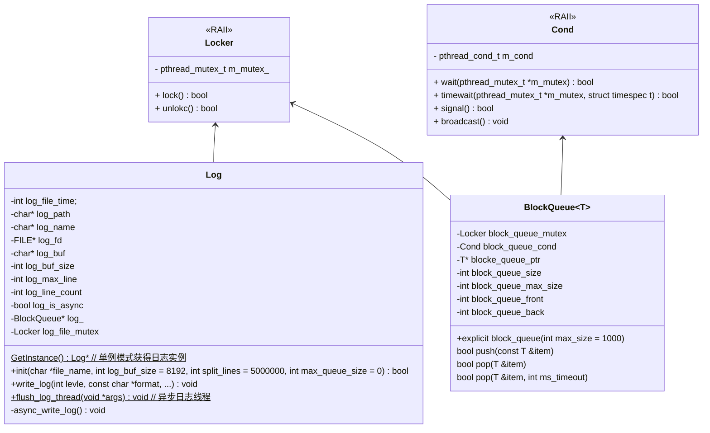
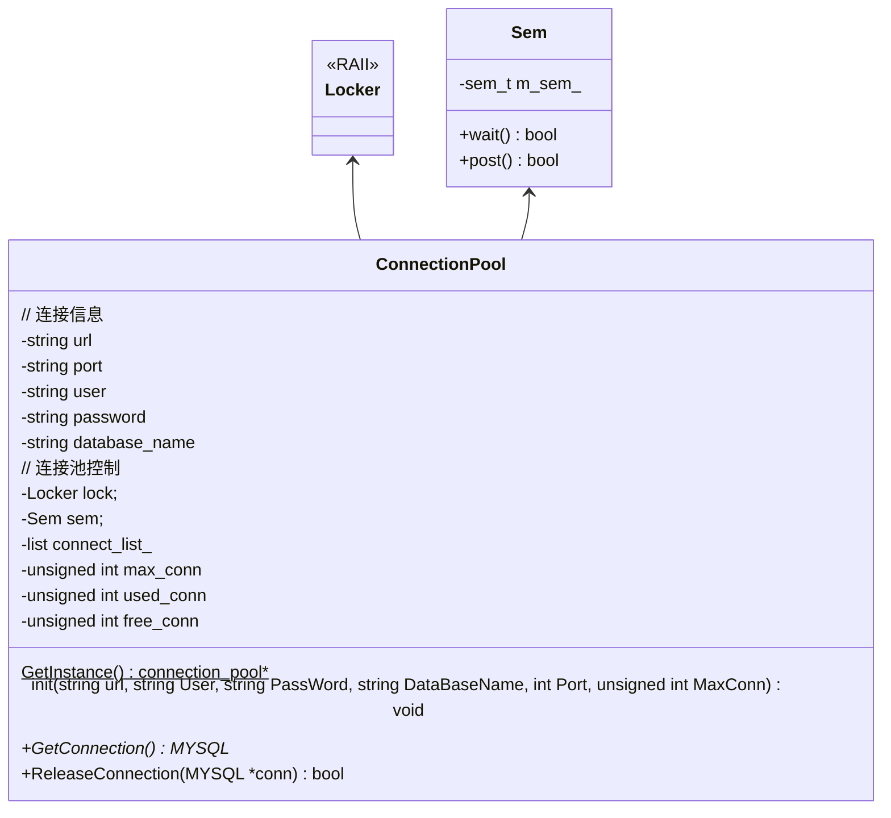
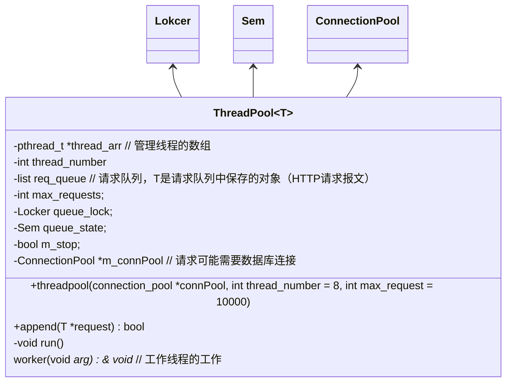
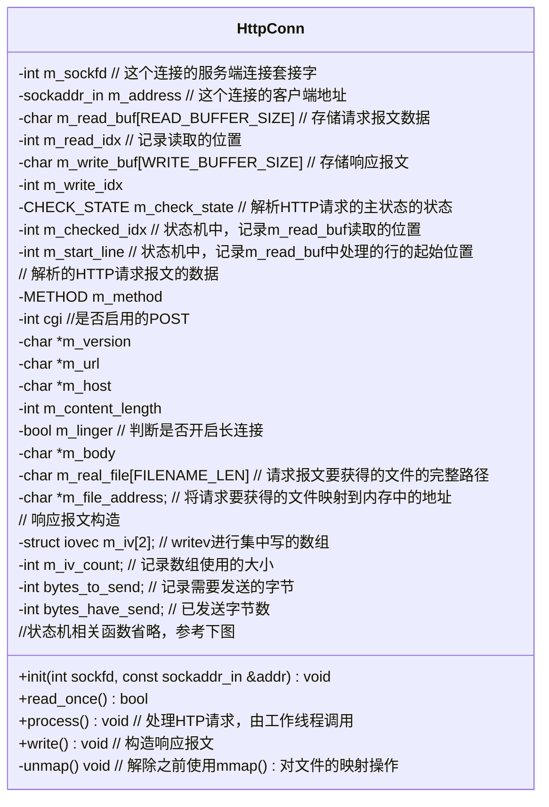

# TinyWebServer

## 项目描述

基于**【Procator事件处理模式】**，使用**【基于epoll的IO复用(支持ET和LT模式)】**和**【线程池】**实现的一个Linux下轻量Web服务器程序，经Webbench压力测试可以实现上万的并发连接

项目模块：日志模块；数据库连接模块；线程模块；线程同步模块；HTTP连接模块；定时器模块；

技术亮点：

- 实现了一个**同步/异步日志系统**，方便记录服务器运行时状态，并支持按天/超行创建日志文件
- 对于用户连接采用epoll实现高效管理，并实现**定时器模块**主动断开非活跃的连接

- 使用**主从有限状态机**解析HTTP报文（支持分段解析），并且考虑用户需要登录、请求服务器图片和视频，实现了一个**MySQL数据库连接池；**

> - Reactor vs Procator
> - epoll vs poll vs select
> - LT vs ET
> - 线程池 & 请求队列

## 项目模块设计与实现思路

### 日志模块



使用**单例模式**生成的唯一的日志对象，通过`Log::init()`在主线程初始化日志对象的的日志文件、缓冲大小，阻塞队列大小等属性

- 为了避免单个日志文件过大，会**限制一个日志文件可以写入的日志条数**，超过就会创建新的日志，并且会**按天创建新的日志**

- 日志先写到缓冲中，如果没有设置异步，则会直接写到文件中；如果设置了异步，则会先写到循环阻塞队列中
  - 阻塞队列中保存是一个string数组，基于生产者-消费者，利用**条件变量+互斥锁**实现控制
  - 异步日志在`Log::init()`时会创建一个线程，负责从阻塞队列中读数据，然后写入文件
  
- 提供宏，方便调用

  ```c++
  #define LOG_DEBUG(format, ...) Log::get_instance()->write_log(0, format, ##__VA_ARGS__) // ##__VA_ARGS__ 可变参数宏
  #define LOG_INFO(format, ...) Log::get_instance()->write_log(1, format, ##__VA_ARGS__)
  #define LOG_WARN(format, ...) Log::get_instance()->write_log(2, format, ##__VA_ARGS__)
  #define LOG_ERROR(format, ...) Log::get_instance()->write_log(3, format, ##__VA_ARGS__)
  ```

> - 单例模式的实现方式 & 常用设计模式介绍
> - 线程同步的机制： 信号量 & 条件变量 & 锁

#### 为什么要用异步日志?

同步日志是指在应用程序进行写操作时，必须等待数据被写入磁盘后才能继续执行后续的操作，由于需要**等待磁盘写入完成，因此性能会受到影响**

异步日志是指应用程序写入日志后，不等待磁盘写入完成就继续执行后续操作，等到合适的时机再写入，这种方式可以提高系统的写入性能

- 可以避免在网络IO线程或业务线程中阻塞在磁盘IO中，后台线程中使用了一次磁盘IO，大大提升了服务器的响应性能和日志信息的处理效率

#### 异步日志不会出现日志乱序的问题吗?

- 首先，日志插入缓存是按其生成时间插入的
- 其次，日志读线程是单线程，每次按顺序从缓存中去日志信息写入文件，因此不会出现乱序问题

#### 为什么不直接用信号量来控制?

- 如果使用信号量，假设一致没有写日志，则刷新日志的线程会频繁加锁检查条件，浪费CPU资源

### 数据库连接模块



基于MySQL提供的API，利用**池化技术**管理数据库连接，为每个接入的HTTP请求都会从池中取出一个MYSQL连接分配给这个HTTP请求对象

通过`connPool->nit()`在主线程初始化MySQL连接池中属性

- 连接池中使用`list<MYSQL*>`保存MYSQL连接句柄，连接池也是要单例模式管理

### 线程模块



基于同步IO的Proactor事件处理模式和半同步/半反应堆并发模型：在主线程中利用`epoll`监听所有socket的事件，进行数据的读写，工作线程负责解析HTTP请求和构造HTTP响应

- 如果有新的连接进来，则主线程负责接收以得到连接套接字，并向`eopll`中注册该socket上的读事件
- 如果连接socket上有读写事件发生，主线程从socket上接收数据，并将数据封装成请求对象插入到**请求队列**中
- 所有**工作线程睡眠在请求队列**上，当有任务到来时，通过竞争获得任务的接管权

因此，使用线程池来管理工作线程

-  one thread one loop思想控制工作线程，工作线程只做读事件，即只处理HTTP请求报文

  ```c++
  //线程函数
  void thread_func(void* thread_arg)
  {
  	//这里做一些需要的初始化工作
  
  	while (线程退出标志)
  	{
  		// 线程工作....
          // 工作线程一旦读取到HTTP请求报文，则会处理这个客户端请求
          request->process();
  	}
  	//这里可能做一些需要的清理工具
  }
  ```

> - Reactor vs Proactor模式

### HTTP模块



HTTP模版包括一个HTTP连接对象，负责处理一个HTTP连接请求，和构造HTTP相应报文

- 用户连接首先需要进行登录，会访问数据库检查用户名和账号

- 基于**有限状态机**，使用主从状态机来解析HTTP请求，并且支持分段解析

  

  - 主状态机负责判断解析的内容：【请求行】，【消息头】，【消息体】
  - 从状态机负责解析的内容：【是否读到完整的一行】，【读取行中的内容是否合法】
  - 在通过状态机解析HTTP请求报文，并构造出响应报文后，将对应的服务端连接套接字增加可写事件，主线程触发后执行`HttpConn::wirte()`发送响应报文

- 考虑到文件的读取，基于`mmap()`实现零拷贝技术，减少拷贝次数，提高读取性能

> - 零拷贝技术

#### 如果收到的HTTP请求报文不完整怎么解析?

- 如果收到的HTTP报文不完整，那么线程取到这个报文，然后调用`HttpConn::process()->HttpConn::process_read()`会返回`LINE_OPEN->NO_REQUEST`表示还需要继续读

  ```c++
  //HttpConn::process()
  if (read_ret == NO_REQUEST)
  {
      modfd(m_epollfd, m_sockfd, EPOLLIN);  // 需要继续监听该连接套接字，判断是否可读
      return;
  }
  ```

- 如果下一次这个sock又有报文到，则主线程中会继续向其中添加数据，然后继续解析

  ```c++
  // main()
  users[sockfd].read_once();	// users是HttpConn数组，确保读取的内容保存的相同的地方
  ```

### 定时器模块

考虑到目前HTTP/1.1默认长连接，为了防止出现长时间空闲的HTTP连接占用服务器的内存（套接字）资源， 实现了一个定时器模块

- 一旦服务器建立一个HTTP连接，就会这个连接创建一个定时器对象
  - 以5s为单位定时，并且在主线程中会利用`alarm()`定时清理过期连接
- 项目自己实现了升序链表，实际可以直接利用map，按时间顺序管理定时器对象，
- 一旦某个连接中发送了请求，就会重置的它的定时时间

### 主线程模块

#### 信号处理

采用**统一事件源**的思想来管理信号:**信号处理函数仅仅发送信号通知程序主循环，将信号对应的处理逻辑放在程序主循环中，由主循环执行信号对应的逻辑**

- 需要创建一个管道来传递信息：主线程监听管道的读端，信号处理函数在写端写入信号值

##### 为什么要统一信号源来处理信号?

- 当进程收到信号时，操作系统会中断进程当前的正常流程，转而进入信号处理函数执行操作
- 为避免信号竞态现象发生，信号处理期间系统不会再次触发它，即屏蔽该信号
- 一般的信号处理函数需要处理该信号对应的逻辑，当该逻辑比较复杂时，信号处理函数执行时间过长，会导致信号屏蔽太久,不利于后续处理

##### 需要处理哪些信号?

```
SIGPIPE: 对一个对端已经关闭的socket调用两次write, 第一次收到会收到一个RST，第二次将会生成SIGPIPE信号, 该信号默认结束进程.(但是服务器不应该因为客户端断开而终止)
SIGTERM：终止程序信号，判断while循环是否结束
SIGALRM：定时器信号，该项目中主要用来释放不活跃的连接
```

> SIGPIPE: 收到一个FIN只意味着这一方向上没有数据流动，一个TCP连接在收到一个FIN后仍能发送数据
>
> - 当某端在通信过程中断开，会向对端发送FIN报文，对端接受到FIN报文后进入`CLOSED_WAIT`状态，但是仍然可发报文，只有在收到RST后再

#### 工作流程

```
1. 创建日志对象
2. 创建MySQL数据库连接池，从中读取用户账号信息保存在内存中
3. 创建线程池
4. 创建监听套接字
5. 创建epoll结构，并其中注册监听套接字
6. 处理信号
7. 创建定时器容器类
8. while循环，利用epoll开始进行监听
	- 如果是监听套接字上的事件，则创建连接
	- 如果是连接套接字上的读事件，则读HTTP请求并处理
	- 如果是连接套接字上的写事件，则发送HTTP响应
	- 如果是管道的事件，则根据信号值进行处理
```

## 项目改进

- 增加动态线程功能以及动态线程的空闲超时时间

  ```
  线程数量是固定的，即使请求队列中有剩余的请求，也不会创建新的线程执行
  并且线程始终在运行
  ```

- 日志模块不够完整

  ```
  目前的日志输出Log::write(int level, const char *format,...)输出的信息不够完整，只有level信息+时间+自定义字符串
  实际可能需要输出代码行，线程号，线程名等信息，方便调试
  并且日志只能保存的文件中，而且只有一种等级的日志
  ```

- 动态配置文件

  ```
  目前只能在代码中利用#define来进行某些选择，比如是否使用异步日志，是否使用LT模式，定时器的时间等不太方便
  可以将个配置类似json yaml写到配置文件中
  ```

- 分配给HTTP请求的数据库连接也可以设置一个超时时间

- 单例模式可以封装起来一个模版类，让需要的类继承

- MySQL连接池设计不对，应该将每个连接抽象成一个对象，连接池中可以保存多种不同连接，而不是现在的这样，连接池中的连接都是一类的

## 相关问题

### 开发过程中遇到了什么问题？如何解决的？

- HTTP报文的解析，因为消息头的首部字段是不限的，那么消息头的长度是未知的 -> 使用了主从有限状态机来解析报文和报文行

- bug,客户端断开连接，服务端直接退出了 -> 忽略SIGPIPE信号

### 为什么要用池化技术？

项目中总共有两处池化技术：MySQL连接池；线程池

#### 数据库连接池

对于一个企业开发环境来说，通常数据库和客户端是分开的，那么MySQL的连接是以TCP/IP套接字的方式实现的

那么进行获取连接都需要进行**TCP三次握手+MySQL认证**，每次断开连接都需要进行**TCP四次挥手**，频繁的建立、关闭连接，会极大的减低系统的性能

优点：

- 资源复用
- 更快的系统响应时间

- 统一的连接管理，避免数据库连接泄漏

##### MySQL连接池的参数如何设置？

- 连接池的大小：**((核心数 \* 2) + 有效磁盘数)**

#### 线程池

- 线程不用频繁的创建和销毁

  ```
  线程尽管轻量，但是创建线程还是需要为其分配大概8M的栈空间，分配tast_struct对象，在内核栈种分配thread_info结构，加入调度，获得程序计数器
  ```

- 更快的响应时间

- 统一的管理，避免用户频繁创建线程，占用服务器资源

##### 线程池中线程参数如何设置?

- **核心线程数**：一直运行的线程。根据线程处理的任务类型，一般有以下设置规则：
  - CPU密集型：CPU核数 + 1；
  - IO密集型： CPU核数 * 2;

- **任务队列长度**：根据每秒的任务数量和线程处理的的速度预估

##### 创建的线程越多性能越高吗？

- 不对。线程数量越多，可能会导致线程切换越频繁， 进而还有可能导致程序运行效率降低。
- 多线程程序的运行效率，呈现为正态分布，线程数量从最开始的1开始逐渐增加，程序的运行效率也逐渐变高，直到线程数量达到一个临界值，然后再次增加线程数量时，程序的运行效率会减小
